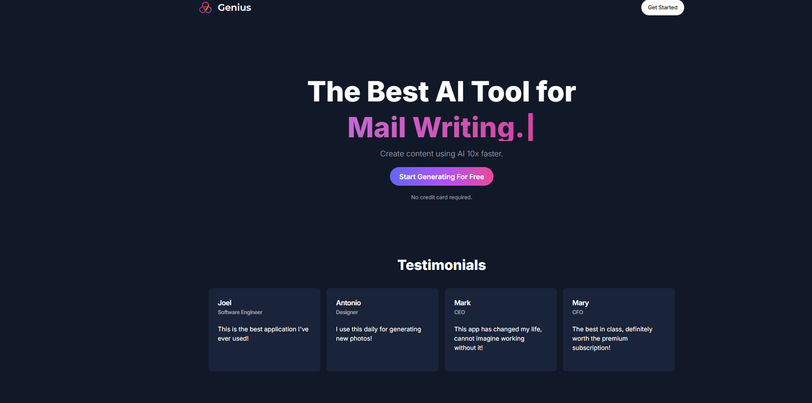
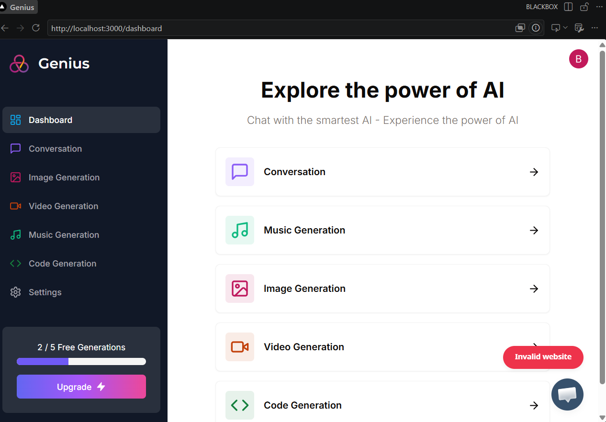
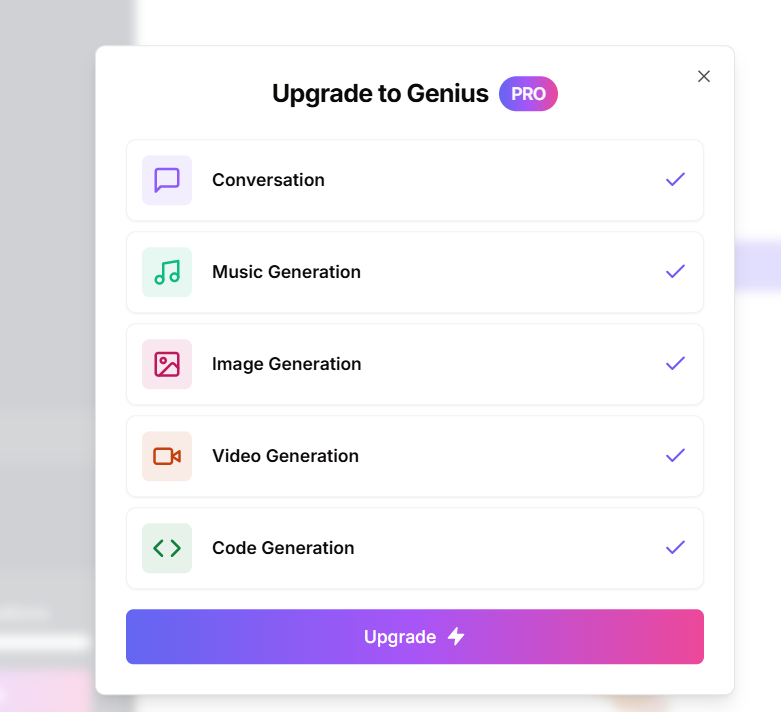
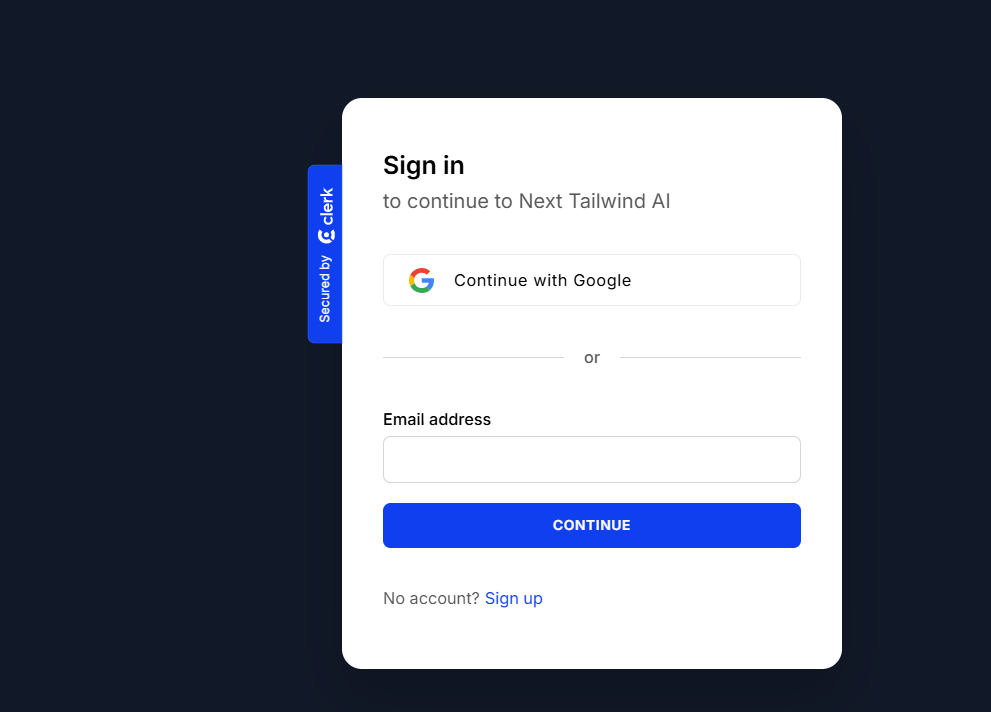

# 🤖 AI SaaS Platform

A full-stack AI SaaS platform built with **Next.js 13, TypeScript, Tailwind CSS, Prisma, MySQL, Clerk, Stripe, and AI APIs**.

The platform provides a modern dashboard where authenticated users can access multiple AI-powered tools from a single application.

---

## ✨ Features

### 🤖 AI Tools

The platform provides multiple AI-powered tools through a unified dashboard:

- 💬 AI Conversation
- 💻 AI Code Generation
- 🖼️ AI Image Generation
- 🎵 AI Music Generation
- 🎬 AI Video Generation

Each tool has its own dedicated interface and API route.
## ✨ App Showcase

<p align="center">
  
  <br/>
  <em>🏠 Clean and modern app look</em>
</p>

<p align="center">
  
  <br/>
  <em>📊 Interactive dashboard with insights</em>
</p>

<p align="center">
  
  
  <br/>
  <em>🚀 Upgrade options & ✍️ Easy signup flow</em>
</p>

<p align="center">
  
  <br/>
  <em>🏢 Facility management made simple</em>
</p>

---

### 🔐 Authentication

Authentication and user management are handled using **Clerk**.

Features include:

- Secure user registration
- Login / logout
- Protected dashboard routes
- User session management
- Authentication middleware

---

### 💳 Subscription Architecture

The application includes a subscription system using **Stripe**.

The architecture supports:

- Free users
- Pro users
- Subscription status checking
- Stripe customer management
- Subscription expiration checking
- Protected premium functionality

Stripe can be configured in test mode for development.

---

### 🗄️ Database

The application uses:

- **MySQL**
- **Prisma ORM**

The database stores application data such as:

- Users
- API usage
- Stripe subscriptions
- AI generation history

Prisma provides type-safe database access and schema management.

---

### 🎨 Modern UI

The application uses:

- Next.js App Router
- React
- TypeScript
- Tailwind CSS
- Radix UI
- Lucide Icons
- Responsive layouts

The interface is designed to work across desktop and mobile devices.

---

## 🛠️ Tech Stack

### Frontend

| Technology | Purpose |
|---|---|
| Next.js 13 | Full-stack React framework |
| React | UI development |
| TypeScript | Type safety |
| Tailwind CSS | Styling |
| Radix UI | Accessible UI primitives |
| Lucide React | Icons |

### Backend

| Technology | Purpose |
|---|---|
| Next.js API Routes | Backend APIs |
| Prisma | ORM |
| MySQL | Relational database |
| Clerk | Authentication |
| Stripe | Subscription/payment infrastructure |

### AI

The application is designed around external AI APIs for:

- Text generation
- Code generation
- Image generation
- Video generation
- Music generation

AI providers can be configured through environment variables.

### Deployment

- Vercel
- MySQL-compatible cloud database
- GitHub

---

# 🏗️ Architecture

```text
                         ┌─────────────────────┐
                         │       Client        │
                         │   Next.js / React   │
                         └──────────┬──────────┘
                                    │
                                    ▼
                         ┌─────────────────────┐
                         │   Clerk Auth        │
                         │ Authentication      │
                         └──────────┬──────────┘
                                    │
                                    ▼
                         ┌─────────────────────┐
                         │   Next.js Backend   │
                         │    API Routes       │
                         └──────────┬──────────┘
                                    │
                  ┌─────────────────┼─────────────────┐
                  │                 │                 │
                  ▼                 ▼                 ▼
           ┌─────────────┐  ┌─────────────┐  ┌─────────────┐
           │    Prisma   │  │    Stripe   │  │  AI APIs    │
           │    ORM      │  │ Subscriptions│  │             │
           └──────┬──────┘  └─────────────┘  └─────────────┘
                  │
                  ▼
           ┌─────────────┐
           │    MySQL    │
           │  Database   │
           └─────────────┘

### Prerequisites

**Node version 18.x.x**

### Cloning the repository

```shell
git clone https://github.com/Alimul-Islam-Eram-Khan/SaaS-AI-Platform.git
```

### Install packages

```shell
npm i
```

### Setup .env file


```js
NEXT_PUBLIC_CLERK_PUBLISHABLE_KEY=
CLERK_SECRET_KEY=

NEXT_PUBLIC_CLERK_SIGN_IN_URL=/sign-in
NEXT_PUBLIC_CLERK_SIGN_UP_URL=/sign-up
NEXT_PUBLIC_CLERK_AFTER_SIGN_IN_URL=/dashboard
NEXT_PUBLIC_CLERK_AFTER_SIGN_UP_URL=/dashboard

OPENAI_API_KEY=
REPLICATE_API_TOKEN=

DATABASE_URL=

STRIPE_API_KEY=
STRIPE_WEBHOOK_SECRET=

NEXT_PUBLIC_APP_URL="http://localhost:3000"
```

### Setup Prisma

Add MySQL Database (I used aiven.io)

```shell
npx prisma db push

```

### Start the app

```shell
npm run dev
```

## Available commands

Running commands with npm `npm run [command]`

| command         | description                              |
| :-------------- | :--------------------------------------- |
| `dev`           | Starts a development instance of the app |
